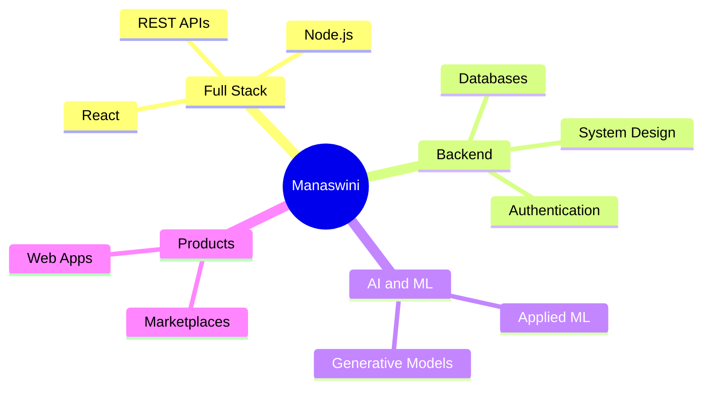

<div align="center">

# Hi, I'm Manaswini


### Building full-stack products, AI-powered applications, and scalable backends

<!-- Uncomment once you have a portfolio site -->
<!-- [](#) -->

[](https://www.linkedin.com/in/manaswini-sripada-b60487298/)
[](mailto:manaswinisripada@gmail.com)
[](#)

</div>

---

## About Me

I'm a **B.Tech student in Electronics & Communication Engineering at IIT Patna**, focused on **Software Engineering, Full-Stack Development, and applied AI/ML**.

I like building end-to-end products — from the interface people actually touch down to the APIs, data models, and infrastructure underneath. Rather than stopping at a working prototype, I'm interested in how software gets structured, tested, deployed, and scaled.

```bash
$ whoami

Manaswini
━━━━━━━━━━━━━━━━━━━━━━━━━━━━━━━━━━

🎓 B.Tech ECE @ IIT Patna

$ current-focus

→ Building full-stack AI products
→ Designing clean REST APIs
→ Studying system design
→ Sharpening DSA and problem solving

$ interests

Software Engineering
Full-Stack Development
Machine Learning
System Design
Backend Engineering
```

---

## Current Focus

### Full-Stack Development

Building complete web applications with React, Node.js, and modern JavaScript tooling — authentication, database schemas, REST APIs, and deployment pipelines.

### Backend & System Design

Designing the layer beneath the UI: data modelling, API contracts, caching, and thinking about how services behave as they grow.

### AI & Machine Learning

Applying models to real product problems — recommendation, generation, and matching — using Python and the standard scientific stack.

### Problem Solving

Working through data structures and algorithms to build the fundamentals that hold up under interview and production pressure alike.

---

## Tech Stack

<div align="center">

<!-- Theme-aware, renders correctly in both light and dark mode.
     Full icon list: https://skillicons.dev — edit the i= list to add or remove. -->


<br>


</div>

---

## GitHub Analytics

<div align="center">


<br>


</div>

---

## Highlights



---

## Featured Projects

<div align="center">

| Project | Description | Tech Stack |
| ------- | ----------- | ---------- |
| **[ThriftVerse](https://github.com/manaswini35/ThriftVerse)** | Full-stack AI-powered thrift marketplace where users can buy, sell, negotiate, and virtually try on second-hand clothing | JavaScript, React, Node.js |
| **[ContextHire](https://github.com/manaswini35/ContextHire)** | Context-aware hiring and candidate matching system | Python |
| **[Melody Generator](https://github.com/manaswini35/melody-generator)** | Generative model for producing musical sequences | Python, ML |
| **[SneakerHead](https://github.com/manaswini35/SneakerHead_)** | Sneaker discovery and storefront web application | JavaScript |
| **[Food Blog](https://github.com/manaswini35/foodblog-clean)** | Content-driven blog application with a clean, responsive frontend | JavaScript |

</div>

<!-- Add rows as you build more. Keep descriptions to one line so the table stays readable. -->

---

## Learning Interests

- Software Engineering & Clean Architecture
- Full-Stack Web Development
- Backend Engineering & APIs
- System Design
- Data Structures & Algorithms
- Databases & Data Modelling
- Machine Learning Applications
- Cloud Deployment & DevOps Basics

---

## Let's Connect

I'm always interested in discussing:

- Software Engineering
- Full-Stack Development
- Backend & System Design
- Machine Learning Applications
- Open Source Projects

<div align="center">

<a href="https://www.linkedin.com/in/manaswini-sripada-b60487298/">

</a>

<a href="mailto:manaswinisripada@gmail.com">

</a>

<a href="#">

</a>

<br><br>


</div>